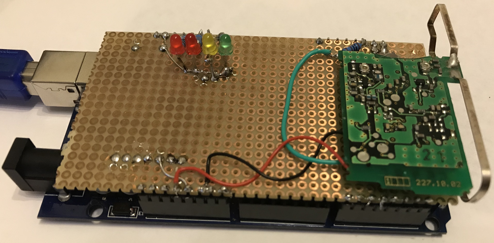
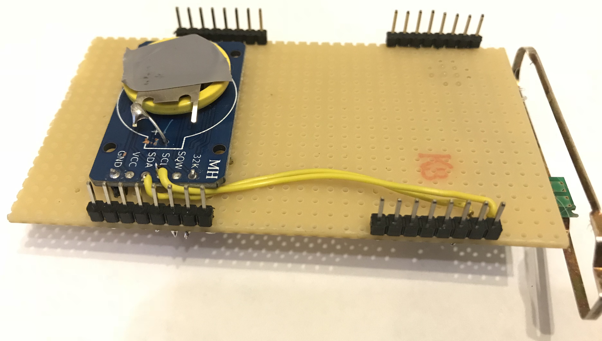

# arduino-pocsag
Arduino based POCSAG decoder using the frequency shift keying demodulator on Motorola pager RF boards.

Tested successfully with up to 1200 baud POCSAG.

Designed for Arduino Mega2560 and optional DS3231 RTC

   
**Sample output:** 

 

**Wiring:**

| pin | used for |
|----------|-------------|
| 19 | Input from RF Receiver Board |
| 20 | DS3231 SCA |
| 21 | DS3231 SCL |
| 8 | LED Preamble detected |
| 9 | LED SYNC word detected |
| 10 | LED for codeword errors|
| 11 | LED for field strength alarm |

**To receive decoded messages, connect it to a terminal with 115200 baud.**

To show configuration help, type "h" in a serial terminal:

| command | used for |
|----------|-------------|
| c0 | Real Time Clock disabled / not installed |
| c1 | Real Time Clock enabled |
| d0 | Debug Output OFF |
| d1 | Debug Output LOW (show statistic summary after decoding) |
| d2 | Debug Output MAX (prints all received codewords) |
| e0 | Error Correction disabled |
| e1 | Error Correction 1 Bit Errors |
| e2 | Error Correction 2 Bit Errors |
| e3 | Error Correction >2 Bit Errors (experimental) |
| l0 | LEDs disabled |
| l1 | LEDs enabled |
| i0 | Input normal |
| i1 | Input inverted (used for LX4 receiver board!)|
| p0 | Parity Check disabled |
| p1 | Parity Check enabled |
| u0 | Umlaut-Replace disabled |
| u1 | Umlaut-Replace enabled |
| ft n | Field Strength Alarm (n minutes; 0 = off) |
| me n | max. number (n) of allowed codewords with incorrectable errors |
| rics x - y | RIC-Filter. Message output only from RIC x to RIC y; set both to 0 to disable filter |
| time dd.mm.yyyy hh:mm:ss | set time |
| time | prints current rtc time |

  **Debug output d2 (MAX) :** 
`cw[0] = 2181040895; // (1) * ` 
- codeword 1 (zero based index!) has the value `10000010000000000000101011111111` (decimal converted 2181040895) with 1 bit error.
- an asterisk shows, that an detected error was corrected. if there is no asterisk, the (not corrected) bit error was in the redundancy part of the codeword
- `//PE` = Parity Error detected in codeword (if parity check `p1` is enabled)

  **Debug output d1 (LOW) :** 
=== [00.00.0000 00:00:00] CW(16) 37ms === 
- at time (in brackets), 16 codewords were decoded which took 37 milliseconds.
